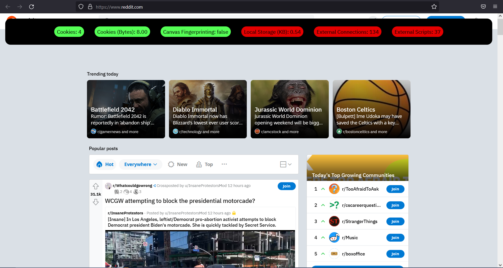

# CookieJar

https://jpgianfaldoni.github.io/CookieJar/

Instalação: https://support.mozilla.org/bm/questions/785686

Plugin firefox para visualização de rastreamento online

Exibe informações em cabeçalho preto, codificando em cores a gravidade de cada medida.

Dados medidos:

Cookies
Cookies (Bytes)
Canvas Fingerprinting (Heurística, não garante nada)
Local Storage (KB)
Conexões externas
Conexões externas a scripts (.js)

Abaixo alguns exemplos em sites famosos:

___
Amazon.com

Reddit.com

Youtube.com

